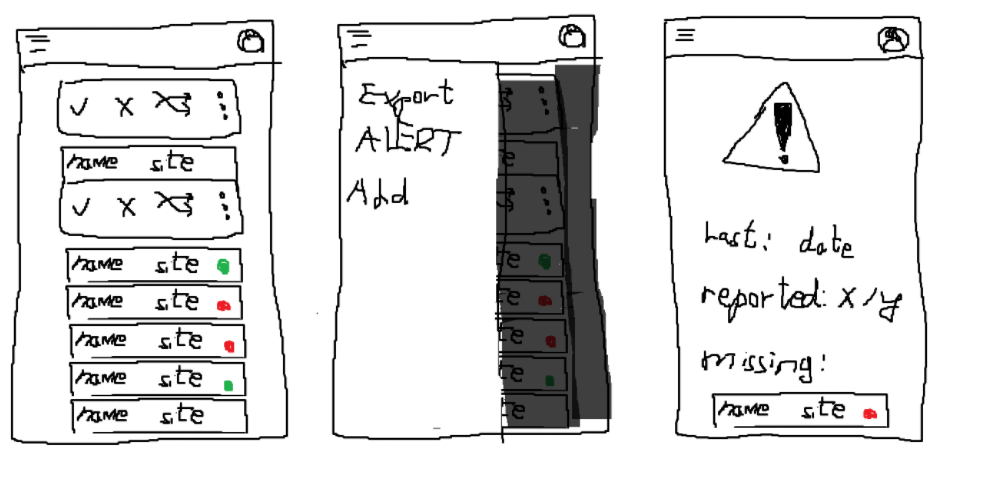

# About

This is a solution targeted to assist personnel management in an immediate circuimstance.

# Usage

1. Build image - `docker build .`
2. Run docker compose with postgresql db
3. Deploy - `docker run -d -p 3000:3000 <image>`

On start up, the service injects a user into the DB with the following id: `feb8bf9c-d2be-4f25-ad79-9d478af482a1`

Right now, any requests made are made as that user, who is an admin.

# To do list:

- Add HTTPS (quick module, should be quick)
- Add tests (actual cancer)
- Get better design/defenition for excel output sheet
  - Add export route logic
- Add alert route + logic
- Socket for alert?
- Add UI (use vite):

  - [ ] Main page
    - [ ] Display all relevant people - Fetch from backend
    - [ ] Sort by those with status 'pending' || transaction 'pending'
    - [ ] On click, drawer opens, can click 'good', 'bad', 'move' - on click modal to move
    - [ ] In body, 3 dots on click - Modal, change permissions
  - [ ] Create user page
    - [ ] Display all users
    - [ ] Plus icon bottom left - on click modal to add user - Send username, password, manager, site, permissions (default - null)
    - [ ] garbage icon to delete person
  - [ ] Export page
  - [ ] Alert page
    - [ ] When last used
    - [ ] How many reported
    - [ ] Who still not reported
  - [ ] Burger menu on banner to navigate
        

- expo? make it a webapp, let push notifications work?
